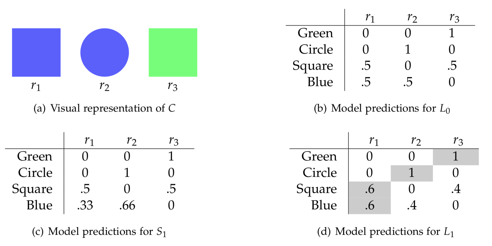

### Modelling Language understanding as Bayesian inference

Fig. 1: Bayesian RSA schema.

<!-- 
The literal listener: PL0(s|u) ∝ u(s) · P(s)
 -->

$$P_{L_{0}}(s\mid u) \propto [\![u]\!](s) \cdot P(s)$$

<!-- \mid -->

~~~
// set of states (here: objects of reference)
// we represent objects as JavaScript objects to demarcate them from utterances
// internally we treat objects as strings nonetheless
var objects = [ { room: "blue", 
                  shape: "square", 
                  string: "blue square" 
                },
                { color: "blue", 
                  shape: "circle", 
                  string: "blue circle" 
               },
                { color: "green", 
                  shape: "square", 
                  string: "green square"
               } 
              ]
~~~

> **Exercises:** 

> 1. Check what happens with the other utterances.
> 2. In the model above, `worldPrior()` returns a sample from a `uniformDraw` over the possible world states. What happens when the listener's beliefs are not uniform over world states? (Hint, use a `categorical` distribution by calling `categorical({ps: [list_of_probabilities], vs: [list_of_states]})`).

Fantastic! We now have a way of integrating a listener's prior beliefs about the world with the truth functional meaning of an utterance.

## Pragmatic speaker

## Using `infer` to Explain Model Behavior

Recall that in chapter 1 we showed how to derive latent structure by using the rules of prob to invert the model.

~~~
var model = function () {
  var A = flip()
  var B = flip()
  var C = flip()
  var D = A + B + C
  condition(D == 3)
  return {'A': A}
};
var dist = Infer({}, model)
viz(dist)
~~~

~~~~
// set of states (here: objects of reference)
// we represent objects as JavaScript objects to demarcate them from utterances
// internally we treat objects as strings nonetheless
var objects = [ 
                { 
                  color: "blue", 
                  shape: "square", 
                  string: "blue square"
                },
                { 
                  color: "blue", 
                  shape: "circle", 
                  string: "blue circle"
                },
                { 
                  color: "green", 
                  shape: "square", 
                  string: "green square"
                } 
              ]

// set of utterances
//var utts = ["blue", "green", "square", "circle"]
//var utterances = powerset(utts).slice(1, powerset(utts).length)
var utterances = [["blue"], ["green"], ["square"], ["circle"],
                  ["blue","square"],["blue","circle"],["green","square"]]

// prior over world states
var objectPrior = function() {
  var obj = uniformDraw(objects);
  return obj
}

// meaning function to interpret the utterances
var meaning = function(utterance, obj){
  var y = filter(function(x) { return _.includes( utterance, x ) }, Object.values(obj));
  var size = Object.keys(utterance).length == Object.keys(y).length;
  return size
}

// literal listener
var literalListener = function(utterance){
  Infer({method:"enumerate"}, function(){
    var obj = objectPrior();
    var uttTruthVal = meaning(utterance, obj);
    condition(uttTruthVal == true)
    return obj
  })
}

var utterance = ["blue","square"]

viz.table(literalListener(utterance))

~~~~

<!---

What about speakers? Speech acts are actions; thus, the speaker is modeled as a rational (Bayesian) actor. He chooses an action (e.g., an utterance) according to its utility. The speaker simulates taking an action, evaluates its utility, and chooses actions in proportion to their utility. This is called a *softmax* optimal agent; a fully optimal agent would choose the action with the highest utility all of the time. (This kind of model is called *action as inverse planning*; for more on this, see [agentmodels.org](http://agentmodels.org/chapters/3-agents-as-programs.html).)

In the code box below you'll see a generic softmax agent model. Note that in this model, `agent` uses `factor` (not `condition`). `factor` is a continuous (or, softer) version of `condition` that takes real numbers as arguments (instead of binary truth values). Higher numbers (here, utilities) upweight the probabilities of the actions associated with them.

~~~~
// define possible actions
var actions = ['a1', 'a2', 'a3'];

// define some utilities for the actions
var utility = function(action){
  var table = { 
    a1: -1, 
    a2: 6, 
    a3: 8
  };
  return table[action];
};

// define speaker optimality
var alpha = 1

// define a rational agent who chooses actions 
// according to their expected utility
var agent = Infer({ method: 'enumerate' }, function(){
    var action = uniformDraw(actions);
    factor(alpha * utility(action));
    return action;
});

print("the probability that an agent will take various actions:")
viz.auto(agent);

~~~~

> **Exercises:**

> 1. Explore what happens when you change the agent's optimality.
> 2. Explore what happens when you change the utilities.

In language understanding, the utility of an utterance is how well it communicates the state of the world $$s$$ to a listener. So, the speaker $$S_{1}$$ chooses utterances $$u$$ to communicate the state $$s$$ to the hypothesized literal listener $$L_{0}$$. Another way to think about this: $$S_{1}$$ wants to minimize the effort $$L_{0}$$ would need to arrive at $$s$$ from $$u$$, all while being efficient at communicating. $$S_{1}$$ thus seeks to minimize the surprisal of $$s$$ given $$u$$ for the literal listener $$L_{0}$$, while bearing in mind the utterance cost, $$C(u)$$. (This trade-off between efficacy and efficiency is not trivial: speakers could always use minimal ambiguity, but unambiguous utterances tend toward the unwieldy, and, very often, unnecessary. We will see this tension play out later in the course.)

Speakers act in accordance with the speaker’s utility function $$U_{S_{1}}$$: utterances are more useful at communicating about some state as surprisal and utterance cost decrease.

$$U_{S_{1}}(u; s) = log(L_{0}(s\mid u)) - C(u)$$

(In WebPPL, $$log(L_{0}(s\mid u))$$ can be accessed via `literalListener(u).score(s)`.)

With this utility function in mind, $$S_{1}$$ computes the probability of an utterance $$u$$ given some state $$s$$ in proportion to the speaker’s utility function $$U_{S_{1}}$$. The term $$\alpha > 0$$ controls the speaker’s optimality, that is, the speaker’s rationality in choosing utterances. 

--->

<!-- 
The pragmatic speaker: PS1(u|s) ∝ exp(αUS1(u;s))
 -->

$$P_{S_{1}}(u\mid s) \propto exp(\alpha U_{S_{1}}(u; s))$$

~~~~
// pragmatic speaker
var speaker = function(world){
  Infer({method:"enumerate"}, function(){
    var utterance = utterancePrior();
    factor(alpha * literalListener(utterance).score(world))
    return utterance
  })
}
~~~~

In the [next chapter](2-pragmatics.html), we'll see how RSA models have been developed to model more complex aspects of pragmatic reasoning and language understanding.